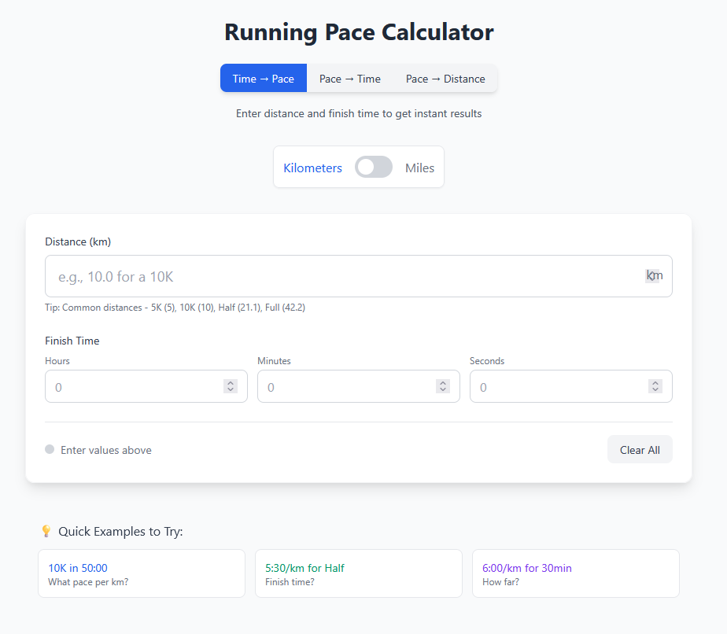

# Running Pace Calculator

A responsive running pace calculator built with React and Vite. Perfect for runners who want to calculate pace, time, and distance conversions instantly.

## Features

### 🏃‍♂️ Multiple Calculation Modes
- **Time → Pace**: Calculate your pace per kilometer/mile from distance and finish time
- **Pace → Time**: Determine your finish time based on distance and target pace
- **Pace → Distance**: Find out how far you can run given a pace and duration

### 🌍 Unit Flexibility
- Switch seamlessly between kilometers and miles
- Real-time calculations and conversions
- Race comparisons adjust based on selected unit

### 💡 Smart Calculations
- Real-time results as you type
- Speed conversion displayed alongside pace (mph/km/h)
- Race distance comparisons (5K, 10K, Half Marathon, Full Marathon)
- Input validation and status indicators

### 🎨 User Experience
- Clean, responsive interface using Tailwind CSS
- Quick example buttons for common scenarios
- Intuitive mode switching
- "Clear All" functionality

## Screenshot



## Quick Examples

Try these common running scenarios:
- **10K in 50:00**: Calculate pace for a 10K in 50 minutes
- **5:30/km for Half**: Find finish time for a half marathon at 5:30 pace
- **6:00/km for 30min**: Determine distance covered running at 6:00 pace for 30 minutes

## Installation

1. Clone the repository:
```bash
git clone <repository-url>
cd pacecalc
```

2. Install dependencies:
```bash
npm install
```

3. Start the development server:
```bash
npm run dev
```

4. Open your browser to [http://localhost:5173](http://localhost:5173)

## Available Scripts

- `npm run dev` - Starts the development server
- `npm run build` - Creates a production build
- `npm run preview` - Locally previews the production build
- `npm run lint` - Runs ESLint to check for code issues

## Tech Stack

- **Framework**: React 19
- **Build Tool**: Vite
- **Styling**: Tailwind CSS
- **Package Manager**: npm

## Contributing

Feel free to submit issues or pull requests if you'd like to contribute to the project!

## License

This project is open source and available under the [MIT License](LICENSE).
